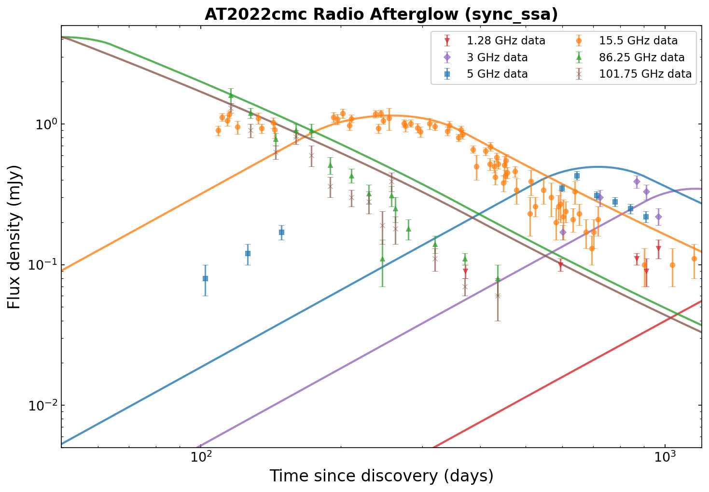

# AT2022cmc: Modeling a Relativistic TDE

This example demonstrates the `FluxDensity_spherical` function with a wind-like CSM density by modeling the multi-frequency radio emission from the jetted tidal disruption event (TDE) AT2022cmc.

## Background

AT2022cmc was discovered on 2022 February 11 at redshift \(z = 1.193\) (\(d_L \approx 8220\) Mpc). It was identified as only the fourth relativistic TDE, with a powerful relativistic jet launched when a star was disrupted by a supermassive black hole. Its multi-frequency radio light curves extend over 3 years, making it an excellent testbed for afterglow models.

Key references:

- Rhodes et al. 2025, ApJ (arXiv:2506.13618) --- 3-year radio monitoring, spherical blast wave modeling with thermal electrons
- Margalit & Quataert 2021, ApJL, 923, L14 --- MQ21 thermal synchrotron formalism
- Ferguson & Margalit 2025 --- FM25 full-volume post-shock extension ([GitHub](https://github.com/RossFerguson1/synchrotron_shock_model))

## Radio data

We use multi-frequency radio data from Rhodes+2025 (Table 1):

| Telescope | Frequency | Band | Epochs |
|-----------|-----------|------|--------|
| MeerKAT | 1.28 GHz | L-band | 5 detections |
| MeerKAT | 3.0 GHz | S-band | 5 detections |
| e-MERLIN | 5.0 GHz | C-band | 9 detections |
| AMI-LA | 15.5 GHz | Ku-band | ~70 detections |
| NOEMA | 86.25 GHz | 3 mm | 15 detections |
| NOEMA | 101.75 GHz | 3 mm | 14 detections |

## Physical parameters

Illustrative spherical blast wave parameters inspired by Rhodes+2025:

| Parameter | Value | Notes |
|-----------|-------|-------|
| \(E_\mathrm{iso}\) | \(1.5 \times 10^{52}\) erg | Isotropic-equivalent kinetic energy |
| \(\Gamma_0\) | 8 | Initial Lorentz factor |
| \(k\) | 1.8 | CSM density power-law index |
| \(A\) | 4000 | Density normalization at \(r = 10^{17}\) cm |
| \(\varepsilon_e\) | 0.1 | Electron energy fraction |
| \(\varepsilon_B\) | 0.04 | Magnetic field energy fraction |
| \(p\) | 2.4 | Electron spectral index |
| \(z\) | 1.193 | Redshift |

## Computing the model

```python
import numpy as np
from blastwave import FluxDensity_spherical
from scipy.integrate import quad

DAY = 86400.0

# Cosmology
z = 1.193
def luminosity_distance(z, H0=70.0, Om=0.3):
    OL = 1.0 - Om
    c_km_s = 299792.458
    result, _ = quad(lambda zp: 1.0 / np.sqrt(Om * (1 + zp)**3 + OL), 0, z)
    return (c_km_s / H0) * (1 + z) * result

d_L = luminosity_distance(z)

P = {
    "Eiso": 1.5e52, "lf": 8.0,
    "A": 4000.0, "n0": 0.0,
    "eps_e": 0.1, "eps_b": 0.04,
    "p": 2.4,
    "theta_v": 0.0, "d": d_L, "z": z,
}

t_model = np.geomspace(50 * DAY, 1200 * DAY, 200)

# Compute sync_ssa for each frequency band
for nu_hz in [1.28e9, 3e9, 5e9, 15.5e9, 86.25e9, 101.75e9]:
    flux = FluxDensity_spherical(
        t_model, nu_hz * np.ones_like(t_model), P,
        k=1.8, tmin=1.0, tmax=1500 * DAY, model="sync_ssa",
    )
```

Key choices:

- **`Spherical` profile** --- isotropic energy, 1-cell tophat fast path
- **`k=1.8`** --- wind-like CSM (\(n \propto r^{-1.8}\))
- **`model="sync_ssa"`** --- synchrotron with self-absorption for the multi-frequency radio evolution

## Plotting



The model captures the key multi-frequency behavior:

- **High frequencies** (86, 102 GHz): Peak early and decline rapidly as the blastwave decelerates
- **Mid frequencies** (15.5 GHz): Extended plateau around 100--400 days before declining
- **Low frequencies** (1.28, 3, 5 GHz): Still rising as the SSA frequency sweeps through the band

## Discussion

The synchrotron self-absorption model reproduces the qualitative frequency-dependent evolution of the radio light curves. The high-frequency NOEMA data constrain the optically thin spectrum, while the low-frequency MeerKAT data trace the SSA turnover.

### Thermal electrons

Rhodes+2025 found that a thermal+non-thermal electron model (`sync_thermal`) with \(\varepsilon_T = 0.4\) better reproduces the steep high-frequency spectral index. The thermal component (Margalit & Quataert 2021) adds an exponential cutoff above the thermal peak frequency, steepening the mm-band decline.

```python
# Thermal + non-thermal model
P_thermal = {**P, "eps_T": 0.4}
F_thermal = FluxDensity_spherical(
    t_model, 86.25e9 * np.ones_like(t_model), P_thermal,
    k=1.8, tmin=1.0, tmax=1500 * DAY, model="sync_thermal",
)
```

## Full script

The complete analysis script is at [`examples/at2022cmc_radio.py`](https://github.com/nuclear-multimessenger-astronomy/blastwave/blob/main/examples/at2022cmc_radio.py). To regenerate the plot:

```bash
python examples/at2022cmc_radio.py
```
