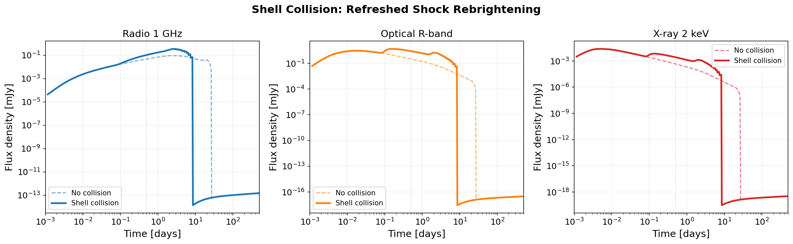
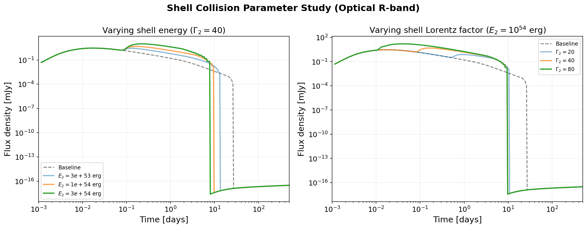

# Shell Collisions: Refreshed Shocks

This example demonstrates how to model **refreshed shocks** from delayed collisions between relativistic shells using the `trailing_shells` parameter.

## Background

Many GRB afterglow light curves exhibit rebrightenings --- episodes where the flux temporarily increases before resuming its power-law decay. A leading physical explanation is **shell collisions**: the central engine launches multiple relativistic shells at different times and with different Lorentz factors. Faster (inner) shells catch up to slower (outer, decelerated) shells and collide, depositing energy and momentum into the blast wave.

Key references:

- Sari & Meszaros 2000, ApJ, 535, L33 --- refreshed shocks from multiple shell collisions
- Kumar & Piran 2000, ApJ, 532, 286 --- energy injection from shell interactions
- Akl et al. 2026, A&A (arXiv:2603.08555) --- multi-epoch rebrightenings in GRB 250129A

## Physics

When a trailing shell (energy \(E_2\), Lorentz factor \(\Gamma_2\), launched at time \(t_\mathrm{launch}\)) catches the decelerating blast wave (Lorentz factor \(\Gamma_1\), total mass \(m_1\)), the collision is resolved via energy-momentum conservation:

\[
\beta\Gamma_\mathrm{merged} = \frac{\beta\Gamma_1 \, m_1 + \beta\Gamma_2 \, m_2}{m_1 + m_2}
\]

The kinetic energy dissipated in the collision thermalizes:

\[
U_\mathrm{th,new} = \left(\Gamma_1 m_1 + \Gamma_2 m_2\right) c^2 + U_\mathrm{th,old} - \Gamma_\mathrm{merged}\left(m_1 + m_2\right) c^2
\]

The trailing shell coasts ballistically at \(R = \beta_2 c (t - t_\mathrm{launch})\) until its radius overtakes the blast wave radius. The collision is detected and resolved **during the ODE integration** in Rust, ensuring proper coupling with the hydrodynamics.

## Usage

Pass a list of `(E_iso, Gamma0, t_launch)` tuples to the `trailing_shells` parameter:

```python
import numpy as np
from blastwave import Jet, TopHat, ForwardJetRes

theta_j = np.radians(6.0)

jet = Jet(
    TopHat(theta_j, 1.7e53, lf0=100.0),  # leading shell
    0.0,                                    # nwind
    1.0,                                    # nism
    tmin=10.0,
    tmax=5e7,
    grid=ForwardJetRes(theta_j, 65),
    tail=True,
    spread=False,
    trailing_shells=[
        (1e54,  40.0,  83.0),         # shell 2: E_iso, Gamma0, t_launch [s]
        (8e53,  25.0,  83.0 + 43200), # shell 3: launched 0.5 days later
    ],
)
```

Each trailing shell is specified as:

| Element | Description | Units |
|:--------|:------------|:------|
| `E_iso` | Isotropic-equivalent kinetic energy | erg |
| `Gamma0` | Initial bulk Lorentz factor | --- |
| `t_launch` | Lab-frame launch time | seconds |
| `theta_max` | *(optional, 4th element)* Maximum half-opening angle; defaults to the jet's \(\theta_c\) | radians |

The flux computation is the same as for any `Jet`:

```python
P = dict(
    Eiso=1.7e53, lf=100.0, theta_c=theta_j, A=0.0, n0=1.0,
    p=2.3, eps_e=0.09, eps_b=2.5e-3,
    theta_v=0.0, z=1.0, d=6700.0,
)

t = np.geomspace(100, 5e7, 400)
flux = jet.FluxDensity(t, 4.68e14, P)  # optical R-band
```

## Multi-band rebrightening

The shell collision produces a chromatic rebrightening whose strength depends on frequency:



**Radio (1 GHz)**: The rebrightening is moderate because self-synchrotron absorption limits the peak flux. The post-collision blast wave has more energy, so it peaks later and brighter than the baseline.

**Optical (R-band)**: The rebrightening is strongest in the optical, where the collision boosts both the characteristic frequency and the peak emission. The light curve shows a clear step up at the collision time.

**X-ray (2 keV)**: The collision produces a noticeable bump in the X-ray, though the effect is somewhat weaker since X-ray emission comes from the highest-energy electrons which cool rapidly.

## Parameter study

The rebrightening amplitude and timing depend on the trailing shell's energy and Lorentz factor:



**Left**: Varying the shell energy \(E_2\) at fixed \(\Gamma_2 = 40\). More energetic shells produce brighter rebrightenings and inject more thermal energy, delaying the eventual deceleration.

**Right**: Varying the shell Lorentz factor \(\Gamma_2\) at fixed \(E_2 = 10^{54}\) erg. Faster shells (\(\Gamma_2 = 80\)) catch up later (closer to the leading shell's speed) and deposit less relative kinetic energy. Slower shells (\(\Gamma_2 = 20\)) catch up sooner and produce stronger collisions due to the larger relative Lorentz factor.

## Physical parameters

| Symbol | Value | Description |
|:-------|:------|:------------|
| \(E_\mathrm{iso,1}\) | \(1.7 \times 10^{53}\) erg | Leading shell energy |
| \(\Gamma_1\) | 100 | Leading shell Lorentz factor |
| \(E_\mathrm{iso,2}\) | \(10^{54}\) erg | Trailing shell energy |
| \(\Gamma_2\) | 40 | Trailing shell Lorentz factor |
| \(t_\mathrm{launch,2}\) | 83 s | Trailing shell launch delay |
| \(n_\mathrm{ISM}\) | 1.0 cm\(^{-3}\) | Ambient density |
| \(\theta_j\) | 6° | Jet half-opening angle |
| \(\varepsilon_e\) | 0.09 | Electron energy fraction |
| \(\varepsilon_B\) | \(2.5 \times 10^{-3}\) | Magnetic energy fraction |
| \(p\) | 2.3 | Electron spectral index |

!!! note "Spread mode"
    Shell collisions are currently supported in the ODE and no-spread solver modes. Use `spread=False` or `spread_mode="ode"`. The PDE spread mode will print a warning and ignore the trailing shells.

!!! tip "Multiple collisions"
    You can specify any number of trailing shells. Each shell is tracked independently and collides with the blast wave when its ballistic radius overtakes the blast wave radius. Shells collide in order of arrival time (not launch time).

## Full script

The complete analysis script is at [`examples/shell_collision.py`](https://github.com/nuclear-multimessenger-astronomy/blastwave/blob/main/examples/shell_collision.py). To regenerate the plots:

```bash
python examples/shell_collision.py
```
